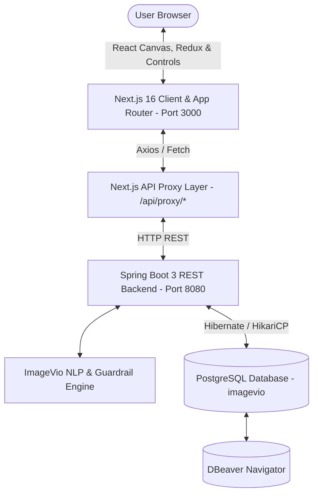

# Imgevio Studio — Comprehensive Implementation Record
**Version:** 2.0  
**Project:** Full-Stack AI Natural Language Image Editing Studio  
**Date:** September 2026  
**Architecture:** Spring Boot 3.3.4 (Java 21) + PostgreSQL 18 + Next.js 16.3.4 (React 19, TypeScript, Redux Toolkit, Tailwind CSS)

---

## 📍 File Locations & Project Paths

### 📁 Root Directory
`/Users/niteshkumartirkey/Public/file/java-opensource/spring-boot-master`

### 📄 Documentation File Location
* **Implementation Record:**  
  `/Users/niteshkumartirkey/Public/file/java-opensource/spring-boot-master/IMGEVIO_IMPLEMENTATION_RECORD.md`

### ☕ Backend Files (Java / Spring Boot)
**Directory:** `/Users/niteshkumartirkey/Public/file/java-opensource/spring-boot-master/imagevio/`

* **Build & Configuration:**
  * `imagevio/build.gradle.kts`
  * `imagevio/settings.gradle.kts`
  * `imagevio/src/main/resources/application.yml`
* **Application & Controllers:**
  * `imagevio/src/main/java/com/imagevio/ImageVioApplication.java`
  * `imagevio/src/main/java/com/imagevio/controller/ImgevioApiController.java`
  * `imagevio/src/main/java/com/imagevio/controller/ImageVioController.java`
* **Services & Security Guardrails:**
  * `imagevio/src/main/java/com/imagevio/service/ImageVioNlpService.java`
  * `imagevio/src/main/java/com/imagevio/service/SecurityGuardrailService.java`
  * `imagevio/src/main/java/com/imagevio/service/TokenService.java`
* **Database Entities & Repositories (PostgreSQL):**
  * `imagevio/src/main/java/com/imagevio/entity/EditSessionEntity.java`
  * `imagevio/src/main/java/com/imagevio/repository/EditSessionRepository.java`
* **DTOs & Data Models:**
  * `imagevio/src/main/java/com/imagevio/dto/ImageEditResponse.java`
  * `imagevio/src/main/java/com/imagevio/dto/ImageOperation.java`
  * `imagevio/src/main/java/com/imagevio/dto/OperationParameters.java`
  * `imagevio/src/main/java/com/imagevio/dto/PromptRequest.java`
  * `imagevio/src/main/java/com/imagevio/dto/SessionInitResponse.java`
* **Unit Tests:**
  * `imagevio/src/test/java/com/imagevio/ImageVioNlpServiceTest.java`

---

### ⚛️ Frontend Files (Next.js / React / Redux)
**Directory:** `/Users/niteshkumartirkey/Public/file/java-opensource/spring-boot-master/imagevioUi/my-app/`

* **Pages & Routing (App Router):**
  * `imagevioUi/my-app/app/page.tsx` (Landing Page & Session Launcher)
  * `imagevioUi/my-app/app/editor/[sessionId]/page.tsx` (Dynamic Studio Workspace)
  * `imagevioUi/my-app/app/layout.tsx` (Root Layout with Redux Provider)
  * `imagevioUi/my-app/app/api/proxy/[...path]/route.ts` (Secure Spring Boot Backend Proxy)
  * `imagevioUi/my-app/app/globals.css` (Tailwind Styles)
* **Modular UI Components:**
  * `imagevioUi/my-app/components/CanvasEditor.tsx` (HTML5 Canvas, Drag-and-Drop, Crop Window)
  * `imagevioUi/my-app/components/CommandBar.tsx` (Natural Language AI Prompt Input)
  * `imagevioUi/my-app/components/Toolbox.tsx` (3-Tab Studio Toolbar & Crop Controls)
  * `imagevioUi/my-app/components/HistoryPanel.tsx` (Layer History & Snapshot Undo/Redo)
* **Global State (Redux Toolkit):**
  * `imagevioUi/my-app/store/store.ts` (Store Configuration)
  * `imagevioUi/my-app/store/editorSlice.ts` (Editor Reducers, Crop State, Snapshot History)
  * `imagevioUi/my-app/store/hooks.ts` (Typed useAppDispatch and useAppSelector hooks)
  * `imagevioUi/my-app/store/provider.tsx` (Client-side Redux Provider wrapper)
* **API Services & Security Utilities:**
  * `imagevioUi/my-app/services/apiService.ts` (Axios API Service)
  * `imagevioUi/my-app/utils/security.ts` (DOMPurify and Zod validation)
  * `imagevioUi/my-app/types/editor.ts` (TypeScript interfaces and DTOs)

---

## 1. System Architecture Overview



---

## 2. Backend Implementation (Java / Spring Boot)

### 2.1 Dependencies & Technology Stack
* **Java Version:** JDK 21 LTS
* **Framework:** Spring Boot 3.3.4
* **Database Driver:** `org.postgresql:postgresql`
* **Security & JWT:** `io.jsonwebtoken:jjwt-api:0.12.6` (HS256)
* **Data Access:** Spring Data JPA + Hibernate
* **Connection Pool:** HikariCP (`max-pool-size: 20`, `min-idle: 5`)
* **Monitoring:** Spring Boot Actuator

### 2.2 Core Backend Classes

| Class | Path | Purpose |
| :--- | :--- | :--- |
| **`ImageVioApplication.java`** | `imagevio/src/main/java/com/imagevio/` | Spring Boot main entry point. |
| **`ImgevioApiController.java`** | `imagevio/src/main/java/com/imagevio/controller/` | Exposes `/api/sessions/init`, `/api/parse/command`, `/api/v1/imagevio/parse`, `/api/sessions/{sessionId}`. |
| **`ImageVioNlpService.java`** | `imagevio/src/main/java/com/imagevio/service/` | Parses conversational commands into JSON actions (`resize`, `crop`, `rotate`, `adjust_brightness`, `color_adjust`, `add_text`, `flip`, `filter`). |
| **`SecurityGuardrailService.java`** | `imagevio/src/main/java/com/imagevio/service/` | Protects against prompt injection, shell escapes, eval/exec commands, and role overrides. |
| **`TokenService.java`** | `imagevio/src/main/java/com/imagevio/service/` | Generates and validates HS256 JWT tokens for 24-hour editing session lifecycles. |
| **`EditSessionEntity.java`** | `imagevio/src/main/java/com/imagevio/entity/` | JPA Entity for database persistence of editing sessions and JSON pipelines. |
| **`EditSessionRepository.java`** | `imagevio/src/main/java/com/imagevio/repository/` | Spring Data JPA repository for Postgres operations. |

---

## 3. Database & Schema Design (PostgreSQL)

* **Database Engine:** PostgreSQL 18.4
* **Database Name:** `imagevio`
* **User:** `postgres`
* **Password:** `Apple123!@#`
* **Port:** `5432`

### Relational Tables in `imagevio`:

1. **`edit_sessions`**
   * `id`: BIGSERIAL PRIMARY KEY
   * `session_id`: VARCHAR(255) UNIQUE NOT NULL
   * `prompt`: TEXT
   * `status`: VARCHAR(50) NOT NULL (`active` / `blocked`)
   * `operations_json`: TEXT
   * `created_at`: TIMESTAMP DEFAULT NOW()

2. **`users`**
   * `id`: BIGINT GENERATED BY DEFAULT AS IDENTITY PRIMARY KEY
   * `username`: VARCHAR(255) UNIQUE
   * `email`: VARCHAR(255) UNIQUE
   * `password`: VARCHAR(255)
   * `created_at`: TIMESTAMP DEFAULT NOW()

3. **`image_assets`**
   * `id`: BIGINT GENERATED BY DEFAULT AS IDENTITY PRIMARY KEY
   * `session_id`: VARCHAR(255) NOT NULL
   * `file_name`: VARCHAR(255)
   * `file_url`: TEXT
   * `width`: INT, `height`: INT
   * `created_at`: TIMESTAMP DEFAULT NOW()

4. **`operation_history`**
   * `id`: BIGINT GENERATED BY DEFAULT AS IDENTITY PRIMARY KEY
   * `session_id`: VARCHAR(255) NOT NULL
   * `sequence_id`: INT NOT NULL
   * `action_type`: VARCHAR(50) NOT NULL
   * `parameters_json`: TEXT
   * `created_at`: TIMESTAMP DEFAULT NOW()

---

## 4. Frontend Implementation (Next.js & Redux Toolkit)

### 4.1 Technology Stack
* **Framework:** Next.js 16.3.4 (App Router, Turbopack)
* **Library:** React 19 / React DOM 19
* **State Management:** `@reduxjs/toolkit` + `react-redux`
* **Icons:** `lucide-react`
* **Sanitization:** `dompurify` + `zod`
* **HTTP Client:** `axios`
* **Styling:** Tailwind CSS v4

---

## 5. Interactive Features & Studio Controls

### 5.1 Interactive Crop Controls
* **Rectangle Crop Box:** Visual window with rule-of-thirds grid.
* **Circle Crop Mask:** Circular clipping path for avatars/profile pictures.
* **Live Drag:** Click and drag the crop window anywhere on the canvas to reframe.
* **Dimension Slider:** Scale the crop box dynamically from 60px to full image bounds.
* **Apply / Cancel:** Instant preview and one-click commit or cancel.

### 5.2 Text & Typography Engine
* **Add Text:** Add custom styled text anywhere on the canvas.
* **Reposition:** Drag text layers freely with mouse cursor.
* **Inspector:** Real-time font size slider ($14\text{px} - 120\text{px}$), color picker, text editor, and delete button.

### 5.3 Color Grading & 50+ Filters
* **Sliders:** Real-time Brightness, Contrast, and Saturation adjustments.
* **Effects:** `grayscale`, `sepia`, `vintage`, `blur`, `invert`, `black_and_white`, `oil_painting`, `pencil_sketch`, `pop_art`, `comic`, `neon`.
* **Transforms:** 90°, 180°, 270° rotations and Horizontal / Vertical flips.

### 5.4 Redux Snapshot Undo / Redo
* Maintains an immutable stack of up to **50 full state snapshots**.
* Reverts or reapplies any canvas edits, text layers, rotations, crops, or AI operations.

### 5.5 Sleek 3-Tab Toolbar Layout
* **Tools Tab:** Text additions, Shape Cropping, and Orientation controls.
* **Adjust Tab:** Color balance & grading sliders.
* **Filters Tab:** Compact 2-column preset effect grid.
* **Export:** One-click instant download in **PNG** or **JPG** format.

---

## 6. Security Guardrails & Hardening

1. **Frontend Layer:**
   * **DOMPurify:** Cleanses text prompts and strips dangerous HTML/scripts.
   * **Zod Validation:** Restricts prompts to 500 characters and whitelisted character sets.
   * **Hydration Protection:** Dynamic UUID session tokens generated in event handlers rather than SSR render cycles.

2. **Backend Pre-Processing Layer:**
   * **Prompt Injection Defense:** Blocks attempts like `"disregard previous instructions"`, `"act as a terminal"`, `"eval()"`, `"exec()"`, `DROP TABLE`, and shell backticks.
   * **Resource Exhaustion Shield:** Clamps dimensional inputs ($1 - 4096\text{px}$) and rotation angles ($-360^\circ$ to $+360^\circ$).
   * **Fallback Response:** Returns exact safety schema:
     ```json
     {
       "session_status": "blocked",
       "error_message": "Invalid or unsafe command syntax detected. Please provide a standard image editing instruction.",
       "parsed_operations": []
     }
     ```

---

## 7. How to Run the Full Stack

### 🐘 1. Database (PostgreSQL)
Ensure PostgreSQL is running on port `5432`:
* **Host:** `localhost:5432` | **DB:** `imagevio` | **User:** `postgres` | **Password:** `Apple123!@#`

### ☕ 2. Backend Service (Spring Boot)
```bash
cd /Users/niteshkumartirkey/Public/file/java-opensource/spring-boot-master/imagevio
./gradlew bootRun
```
* **Port:** `http://localhost:8080`

### ⚛️ 3. Frontend Application (Next.js)
```bash
cd /Users/niteshkumartirkey/Public/file/java-opensource/spring-boot-master/imagevioUi/my-app
npm run dev
```
* **Port:** `http://localhost:3000`
